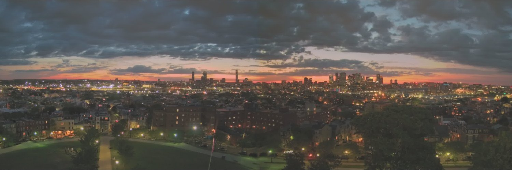

# BostonTimelapse



## tl:dr
I made a fully automated timelapse build pipeline with python, FFmpeg and a raspberry pi 4. It creates beautiful timelapses of Boston, MA using images from webcams installed by the National Parks Service in Boston. 

1. It pulls down images every minute from [this NPS website](https://www.nps.gov/bost/learn/views-of-the-revolution-360-monument-webcams.htm), processes them and saves them with some basic error handling
2. It builds timelapses twice a day with [FFmpeg](https://ffmpeg.org). In the morning it builds them with images from an hour before sunset the day before to an hour after sunrise that morning. At night it builds them with images captured from the beginning of nautical twilight before sunrise to the end of nautical twilight after sunset that day
3. It uploads the completed videos to [https://vimeo.com/bostontimelapse](https://vimeo.com/bostontimelapse) and sorta [https://www.youtube.com/channel/UCMDyNjlXSzs-YenlyYpcuhQ](https://www.youtube.com/channel/UCMDyNjlXSzs-YenlyYpcuhQ)
4. It tweets via [https://twitter.com/BostonTimelaps1](https://twitter.com/BostonTimelaps1) 
5. It [posts to instagram](https://www.instagram.com/bostontimelaps1/)


The idea behind this post is to give something back to the developer and aspiring developer community after cribbing so much from around the web to build this. I'd be more than content if someone finds a useful nugget about anything in this writeup.

Huge thank you to the National Parks Service of Boston! More acknowledgements at the end.

[Have a look at my crappy code](https://github.com/BostonTimelapse/timelapse)


## I have no idea what I am doing

Though I've spent years working for software companies I am absolutely not a developer or engineer. I sort of have a high level handle on many concepts but I have no idea what I am doing when it comes to practical matters. I 'taught' myself some python, some command line skills and rudimentary linux administration. This is my third attempt at doing something useful in 10 years. Please feel free to judge. This is all for fun and of course unadultered frustration. For most things I've done and shared I am sure there is a faaaaar better way. 

## Random background

The pandemic kept our children at home for 117 days. When they returned to daycare/school *(and we are damn lucky they did)* we were required to fill out a google form daily stating no-one in the family had any covid-19 symptoms. It got annoying. 

I decided to automate the form fill. I had no idea what I was doing. I copied some college kid's script that they were using for class attendance (can't find it again or would give them credit) refactored it for my form and then did a couple random things I thought were creative (but really aren't so much).

• Set it up to manage multiple kids

• Set up slack notifications for simple monitoring

• Scheduled it daily on [pythonanywhere.com](https://www.pythonanywhere.com/) and then violated their terms of service (I assume) by logging in via code and then automatically extending the expiry of the free-tier scheduled job. I'm deeply sorry about this. I did it not to cheat so much as to figure out if I could. [https://www.pythonanywhere.com/](https://www.pythonanywhere.com/) is awesome. I'm a jerk. I'll make it up to them. Think I owe them about $50.

## Inspiration

I had done a thing and was pretty convinced I could do another thing but then forgot about doing things with code (-ish I remained unreasonably happy about not filling out google forms every day)...

But in March 2021 the National Parks Service installed webcams on the Dorchester Heights Monument in South Boston near where I live. The feed is posted at [NPS views of the revolution](https://www.nps.gov/bost/learn/views-of-the-revolution-360-monument-webcams.htm) and NPS Boston put together a [video of the install](https://youtu.be/O3RD44dI0js).

I don't remember how the webcams captured my attention but I got really obsessed with checking the feeds - mostly just to check on the weather or the tides. I found the link to the raw image and embedded it on the home screen on my iphone so I could check it constantly.

Somehow I got the idea to capture the images every minute they updated and stitch them into timelapses. For me this is as close to the creative lightning bolt as you can get.

I got more obsessed.*

**Boston NHP has a [youtube channel](https://www.youtube.com/channel/UCZtogJtoLct5o2hSwXmB-2g) with a bunch of timelapses posted to it. I did not see those until I started this writeup. I'm glad I didn't - it might have discouraged me.*

 

## I did a thing

The [raw image](https://bh.bostonnpsevents.com/autostitch/pano_dohe.jpeg) kind of baffled me because I had zero working knowledge of how images are stitched together or cropped with code. Took me some haphazard googling to figure out that I could automatically process and crop it with opencv-python. Once I snipped some examples from stackoverflow I managed to process the image how I wanted and started to pull it down and process it every minute via cron on my laptop.

My plan was to make a timelapse using imovie but I thought I might be able to do it faster via some python library or something (I have limited experience but imovie can be a slow pain). Thankfully I found [ffmpeg](https://www.ffmpeg.org/) and figured out how to produce timelapses via code for each of the cardinal directions.

I thought the thing I did was cool and I wanted to share it. I got the idea that creating timelapses from the images I was grabbing could be *easily* automated. I was dead wrong about how easy it would be but automating everything did become the mantra of this project. The only thing that is not automatic right now is writing tweet copy for scheduled or adhoc tweets. Even then it will run default tweets if I don't override them.


## Raspberry Pi 4
The laptop goes to sleep and has to be used for other more important stuff that might break the workflow. My first thought was to give [pythonanywhere.com](https://www.pythonanywhere.com/) its due and build there but some quick calculations made me worry about storage in the long term. I had an old 2tb usb hdd lying around so my second thought was why not give a raspberry pi a whirl.

I heard of raspberry pis a looong time ago (when they first were released?) and always thought... "sounds cool but wtf am I gonna use it for?" This project apparently... so I ordered one (with an imaged sd card... didn't need to make it too hard and creating an image seemed intimidating) and anxiously awaited its arrival. At the time I had a working python script to process the images and really simple bash script to build timelapses with ffmpeg. I thought I was ready to go especially once I figured out how to join the four different directions into one video.

#### setup
I had no keyboard, mouse or monitor so was convinced this little pi had to run headless. I surprised myself when I got it [working](https://www.raspberrypi.org/documentation/configuration/wireless/headless.md) and [relatively locked down](https://www.raspberrypi.org/documentation/configuration/security.md) in an hour following the awesome doc on [raspberrypi.org](https://www.raspberrypi.org/documentation).

I was surprised again when I unplugged it to move it to its permanent location in a closet and it didn't come back up when reconnected (yep didn't properly shut it down). The initial setup was so easy I was shocked I could wreck the thing so thoughtlessly. I think I spent 3 hours trying to get it to reconnect to my home wifi. Didn't succeed but somehow ethernet worked. I went to bed at 1 that night. Our kids were up at 5 the next morning.

#### operational misadventures
I love the pi. It really just works. I marvel at the history and sheer volume of development effort - especially open source (assuming it's not all historically open given the initial *nix lift had to come from somewhere... I also don't know what I'm talking about) - that makes this thing tick. So cool that someone like me can take advantage of it. But someone like me is also really good at breaking it by accident and not really knowing why.

Here's a rundown of the messes I made and how I cleaned them up:

1. **mess:** For some reason or another I thought I needed to do a full update and ran `sudo apt update` then `sudo apt full-upgrade`. The system just hung and I could not kick off another ssh session to try and kill processes. I coudn't figure out what to do so I unplugged it again. it would not come back up.

	**solution:** I assumed I'd wrecked the os. My 2012 macbook pro has an sd card reader and was able to reimage the sd card via [rasberry pi imager](https://www.raspberrypi.org/software/) and [extfs for mac](https://www.paragon-software.com/us/home/extfs-mac/) - extfs is paid unfortunately but you can use it for free for a short time. Was a lot faster and easier than I thought it would be. I ended up buying extfs for mac.
 
	**consequences:** 
	- I had to set up the pi from scratch again
	- I was lazy about setting up a git workflow. Seemed complicated to me given I have no idea what I am doing. I lost some code changes I had made that I had to rewrite. Not sure if it's a good or bad plan but my code lives on the sd card (everything else on the external disk)
	- Big window of time where I wasn't pulling new images
	- Lots of lost time and significant frustration

2. **problem:** Something in this borked upgrade helped lead the old hdd to failure. Can't remember exactly what made me think it was the drive causing problems and I wasn't 100% sure it was gone but just after I rescued the files to my mac (extfs for mac again to the rescue) to be careful it died for good.
 
	**solution:** I nearly ordered a new drive via amazon. Then my pandemic-fried brain remembered brick and mortar shops exist for instant gratification. I set up a brand new drive and copied my rescued files over once I had a working os and working external storage 
 
	**consequences:** 
	- Contributor to the big window of time where I wasn't pulling new images
	- More lost time and more frustration
 	- Thankfully no data loss from the old disk
	- I made [a back up of my image](https://www.tomshardware.com/how-to/back-up-raspberry-pi-as-disk-image) and stored one on my mac and the usb disk
	- I thought about backing up the usb disk but did not do it

3. **problem:** I rebooted the pi for one reason or another and the file system reverted to an older state. Whut? Something like [this](https://www.raspberrypi.org/forums/viewtopic.php?t=21330) was going on and the sd card was probably wrecked. Maybe it was recoverable but figured a new one couldn't hurt.

	**solution:** I ran back to bestbuy and bought a new sd card (and another hdd for backup storage). It is 32gb and the old one was 16gb. The compressed via [pishrink](https://github.com/Drewsif/PiShrink) image restored and resized perfectly to the new card. The pi came right back up in a nicely configured and ready-to-go state. It felt like magic. I was so happy. 

	**consequences:** Nothing more than lost time and lost image downloads. A functional backup is the best. In retrospect the root cause of problem 1 was probably related to the sd card too. 

4. **problem:** I got around to setting up the second usb hdd. I plugged it in to the second usb port did some googling to figure out how to format it, mounted it and the first disk became unmounted. Wtf? Lots more weird behavior later and I figured out what was going on. [You cannot mount two unpowered usb hdds to a pi 4](https://www.raspberrypi.org/forums/viewtopic.php?t=253792). Whoops. Stopped trying to do that and thought I was on my way. The next time I ran my timelapse build process it failed because it could not read the source images. I ran `ls -l` on the image directory and saw some images had 0 for file size. I tried to `rm` them. I tried `rm -f`. I tried `sudo rm -f`. I tried `ls -li` to find their inode and delete them that way. Nope, kept getting something like this `rm: cannot remove 'file': Bad message`. Something was clearly corrupted.
 
	**solution:** Lots more googling and 'discovered' fsck. Ran a playbook I found somewhere and blammo it was fixed. That was cool. It was also midnight and I was fried. The next day I ordered a powered usb hub so I can connect another drive. In a hugely embarassing moment I had no idea how this hub worked and thought it was broken so Amazon shipped me a new one. Not gonna talk about that (basic diagram woulda been nice though). 
 
	**consequences:** More images I failed to capture, not to mention lost time, lost sleep and increased frustration.
 
5. **problem:** Raspberry pi tipped over while I was out of town and was totaly unresponsive. Could not SSH to it. This freaked me out and I was worried it was hacked.
 
	**solution:** Turns out the pi was the least of my problems when I got home. Our fridge had failed too. Lots of spoiled freezer food. This is the second time that's happend in 4 months. Lucky to be able to afford a new fridge. Anyway, cycling the power the pi came right back up. I did a lot of poking at logs to investigate and what I think happened is the pi did an automated update via `apt-daily.service` and it hung.  It eventually came back up and my cronjobs ran but it was disconnected from the network. I think it is because there was a message in the process that needed to be accepted (this happened when I did it manually - didn't grab the message. Sorry should have) and the whole thing hung. Since I already ran that `apt update` and `apt upgrade` manually there isn't a good way for me to reproduce.  Either way I stopped that the automated updates.  I'll just have to be diligent about doing it myself regularly. 
 
	**consequences:** About 14 hours of images lost.
   
 
## Automated pipeline
Almost everytime I got something working I had an idea to extend it further. Or it dawned on my I'd done something stupid. In general I tried to keep scripts modular so they could be chained togehter and run via cron. Here's a high level summary of the big iterations with the associated ideas that made me break them. Each step was a lot of work and a significant learning experience. The goal was always to keep everything automated with no intervention needed. Was at least 6 weeks before I got a few days running in a row.

1. Early version of getimages.py --> Defunct bash script that created time lapses
	- Idea: decide which images to build from based on date and astronomical data and group them together 
2. getimages.py --> timelapsebuilder.py
	- Idea: Automatically upload videos to youtube
3. getimages.py --> timelapsebuilder.py --> defunct youtube upload script
	- Idea: Automatically upload videos to vimeo
4. getimages.py --> timelapsebuilder.py --> vimeo\_upload\_youtube_prep.py --> youtube\_upload.py
	- Idea: Tweet about the videos automatically (this was my wife's idea and I needed her help... I'd never really used twitter)
5. getimages.py --> timelapsebuilder.py --> vimeo\_upload\_youtube_prep.py --> youtube\_upload.py --> twittertimelapsebot.py
	- Idea: Run two build pipelines so I could grab the images from Bunker Hill too. 
6. Refactored everything to take config files and some command line arguments
	- Idea: Instagram (also my wife's idea... and this was a massive time suck. I almost gave up.)
7. getimages.py --> timelapsebuilder.py --> vimeo\_upload\_youtube_prep.py --> youtube\_upload.py --> instagramandtwitterbot.py
	- Idea: Instagram video clips of sunrise and sunset (eventually this is what made sense to also post to twitter - can see the progression on my feed)
8. getimages.py --> timelapsebuilder.py --> vimeo\_upload\_youtube_prep.py --> youtube\_upload.py --> instagramandtwitterbot.py --> instagram\_clip\_uploader.py (instagram\_clip\_uploader.py easily became part of instagramandtwitterbot.py)

I broke the whole thing every step of the way so many times. Even with the minor changes

##### Further commentary on the components below:

#### python
There isn't a whole lot of special python stuff in this flow. The most important component is [opencv-python](https://pypi.org/project/opencv-python/) and is used for initial image processing. As I understand it all the other modules are pretty common apart from the api client libraries.

The other thing that may be less common is using `subproccess.run()` to call FFmpeg in my workflow. And of course I'm using client libraries for apis. I probably could have used a python FFmpeg wrapper but this is the path I started on. 

#### ffmpeg
[FFmpeg](https://www.ffmpeg.org/) is so awesome. I made a timelapse via imovie once and processing took forever and it was a huge hassle. FFmpeg does this stuff so fast and painlessly I cannot believe it. Even a tiny little pi can just crank through it given enough time. Here's a list of the base commands I used. There are a lot of configurable options here, but this stuff just works.

Base timelapse creation from a bunch of jpgs in a directory

```
ffmpeg -framerate 18 -pattern_type glob -i "/path/to/images/*.jpg" -s:v 1280x720 -c:v libx264 -crf 17 -pix_fmt yuv420p -aspect 16:9 /path/to/output/output.mp4
```

Combine four videos into one feed (note this is video only - the filter needs modification to include audio too). There's actually a better less compute heavy way for me to do this by concatenating the images when they are initially processed and then building one video stream

```
ffmpeg -i /path/to/input0.mp4 -i /path/to/input1.mp4 -i /path/to/input2.mp4 -i /path/to/input3.mp4 -filter_complex "[0:v][1:v]hstack[top]; [2:v][3:v]hstack[bottom]; [top][bottom]vstack,format=yuv420p[v]"
-map "[v]" /path/to/output.mp4
```

Loop a frame at the end of a video where N is substituted for number of seconds there are other ways to do this but not with the debian version of ffmpeg I installed. I actually installed ffmpeg from source to get that feature... but that became a whole painful saga I'm going to omit from this post.
```
ffmpeg -i /path/to/input.mp4 -filter_complex "[0]trim=0:N[hold];[0][hold]concat[extended];[extended][0]overlay" /path/to/output.mp4
```

Snag the last N seconds of a clip - used this for my insta posts
```
ffmpeg -sseof -N -i /path/to/input.mp4 /path/to/output.mp4
```

Grab a clip starting at time X and lasting N seconds - used for randomly generated clips for twitter.
```
ffmpeg -ss X -i path/to/input.mp4 -c copy -t N path/to/output.mp4
```

Get length of video
```
ffprobe -v error -show_entries format=duration -of default=noprint_wrappers=1:nokey=1 /path/to/input.mp4
```

Used a filter like this to crop a square video for instagram.  Do not use it currently.
```
ffmpeg -sseof -18 -i /path/to/input.mp4 -vf crop=720:720:280:0,setdar=1:1,setsar=1:1 /path/to/output.mp4
```

It's mindblowing how powerful ffmpeg is. I barely scratched the surface but it is absolutely the right tool for this job. Also after testing on mac it's pretty funny to see how slow it is on the pi. Totally the little engine that could. And that is sorta the fun of automation... who cares if it is slow? I just care that it happens. 

#### apis
I feel like I used all the big ones on this project. In general the experience was a net-negative in terms of how I think of big tech. And that's probably an understatement. 

1. [sunrise-sunset.org](https://sunrise-sunset.org/api)
I started looking at [timeanddate.com](https://www.timeanddate.com/) but their api is paid. Felt lucky to find [sunrise-sunset.org](https://sunrise-sunset.org). It fits my need perfectly. Huge thank you to them.

2. [youtube](https://developers.google.com/youtube/v3/guides/uploading_a_video) the youtube api is a pain. It's 100% targeted at 	professional developers building apps aimed at other users. There is no way as an individual that you can upload your video to your channel via api and have it be publicly available. The uploads are automatically and irrevokably marked private.

	Somehow it worked for me for a little while but then stopped. I tried to work around this and created a workspace account and made an 'internal' app. Same problem. Imagine they are trying to prevent some kind of abuse but it is annoying af. I just threw in the towel on youtube. Not worth it. Lots of effort down the drain.

	I had also copied their sample python 2 code for uploads. I'm sure I could have refactored it to python 3 but that seemed like a huge hassle. Dealing with python 2 and 3 together was a big problem for me at first.
	
	Every step of the way I've wasted a ton of time with youtube.

3. [vimeo via vimeo's python library](https://github.com/vimeo/vimeo.py) This library/module is super easy. I just wish more people used vimeo. The liklihood of someone tripping over my content on that platform seems to be about zero. At least the videos look good and I can store them there. 

4. [twitter via tweepy](https://www.tweepy.org/) tweepy makes interaction with the twitter api incredibly easy. Abuse seems to be the theme with these apis and I was a little surprised how involved the api access application process was to just be able to access your own account.

5. [instagram via facebook](https://developers.facebook.com/docs/graph-api/) gah I hate(d) this so much. The doc is terrible or misleading or refers to stuff obviously outdated. Part of the problem is the deprecated instagram api and the use of the facebook graph api. The whole thing is such a mess. I did this last when I had a good base of learning about how to deal with apis and it suuuuucked. I almost gave up more than once... but didn't because I was just punishing myself for the sake of 'learning stuff.' Oddly there were zero hoops to jump through to use this api... other than it being terribly confusing. No surprise facebook is rife with bullshit bots.

6. [google storage python client/api](https://googleapis.dev/python/storage/latest/index.html) the facebook graph api only accepts media content on public urls. My shiny new workspace account for the win! Use it post content to a public google storage url, post it the the gram, then delete it. Sadly if this keeps on keeping on will still probably cost me 5 bucks (couldn't be bothered to figure out the markdown(yet another thing I (re)-learned for this) escaping for the dollar sign) a month.

7. [slack webhooks](https://api.slack.com/messaging/webhooks) this super easy to set up but I was able to just copy what I had done for my covid form project. Slack notifications about a bunch of things are really nice to have. 
 
#### bash
I don't do much with bash but what I do is pretty useful. I wrote stupidly simple wrappers for each of my daily runs so the full workflow can be kicked off by a single cron job. I also had to write wrappers for the random image posts in order to properly export the google credentials to the cron job. I am sure I could have architected this entirely in python but I didn't and doing it would require some major refactoring. Creating fully abstracted functions/classes feels really hard right now for my level of experience. I've thought about it... but not gonna go down that road when there are other perfectly fine tools for the job. 

e.g. Morning Dorchester Heights run

```
#!bin/bash
export GOOGLE_APPLICATION_CREDENTIALS="path/to/key.json"
/usr/bin/python3 /path/to/dhtimelapse/timelapsebuilder.py --processbatch=darkness --imagesfrom=today --config=dhconfig.txt
/usr/bin/python3 /path/to/dhtimelapse/vimeo_upload_youtube_prep.py --config=dhconfig.txt --fromhour=6 --tohour=12
#/usr/bin/python /path/to/dhtimelapse/youtube_upload.py --config=dhconfig.txt
/usr/bin/python3 /path/to/dhtimelapse/twittertimelapsebot.py --config=dhconfig.txt --tweets=dhtweets.txt

#note the config file and arguments changes below
/usr/bin/python3 /path/to/dhtimelapse/timelapsebuilder.py --processbatch=darkness --imagesfrom=today --config=bhconfig.txt
/usr/bin/python3 /path/to/dhtimelapse/vimeo_upload_youtube_prep.py --config=bhconfig.txt --fromhour=6 --tohour=12
#/usr/bin/python /path/to/dhtimelapse/youtube_upload.py --config=bhconfig.txt
/usr/bin/python3 /path/to/dhtimelapse/twittertimelapsebot.py --config=bhconfig.txt --tweets=bhtweets.txt
```

Simple wrapper with google creds 

```
#!bin/bash
export GOOGLE_APPLICATION_CREDENTIALS="/path/to/key.json"
/usr/bin/python3 /path/to/dhtimelapse/instagramandtwitterbot.py --config=dhconfig.txt --tweets=dhtweets.txt
```

#### cron
Here are the items in my crontab for this project

```
* * * * * /usr/bin/python3 /path/to/dhtimelapse/getimages.py --config=dhconfig.txt >> /usbdisk/dhtimelapse/logs/cronlogs/imagescronlog.txt 2>&1
* * * * * /usr/bin/python3 /path/to/dhtimelapse/getimages.py --config=bhconfig.txt >> /usbdisk/bhtimelapse/logs/cronlogs/imagescronlog.txt 2>&1
0 6 * * * /usr/bin/python3 /path/to/dhtimelapse/diskcheck.py >> /usbdisk/dhtimelapse/logs/cronlogs/checkstoragecronlog.txt 2>&1
15 21 * * * /bin/bash /path/to/dhtimelapse/evening_cronrun_build_and_upload_wrapper.sh >> /usbdisk/dhtimelapse/logs/cronlogs/buildanduploadcronlog.txt 2>&1
30 06 * * * /bin/bash /path/to/dhtimelapse/morning_cronrun_build_and_upload_wrapper.sh >> /usbdisk/dhtimelapse/logs/cronlogs/buildanduploadcronlog.txt 2>&1
59 23 * * * /usr/bin/python3 /path/to/dhtimelapse/image_check.py --config=dhconfig.txt >> /usbdisk/dhtimelapse/logs/cronlogs/imagecheckcronlog.txt 2>&1
59 23 * * * /usr/bin/python3 /path/to/dhtimelapse/image_check.py --config=bhconfig.txt >> /usbdisk/bhtimelapse/logs/cronlogs/imagecheckcronlog.txt 2>&1
0 * * * * /usr/bin/python3 /path/to/dhtimelapse/image_check.py --config=dhconfig.txt >> /usbdisk/dhtimelapse/logs/cronlogs/imagecheckcronlog.txt 2>&1
0 * * * * /usr/bin/python3 /path/to/dhtimelapse/image_check.py --config=bhconfig.txt >> /usbdisk/bhtimelapse/logs/cronlogs/imagecheckcronlog.txt 2>&1
05 12 * * * /bin/bash /path/to/dhtimelapse/dhrandomimagewrapper.sh --config=dhconfig.txt --tweets=dhtweets.txt >> /usbdisk/dhtimelapse/logs/cronlogs/instagramandtwitterbotcronlog.txt 2>&1
45 12 * * * /bin/bash /path/to/dhtimelapse/bhrandomimagewrapper.sh --config=bhconfig.txt --tweets=bhtweets.txt >> /usbdisk/dhtimelapse/logs/cronlogs/instagramandtwitterbot.pycronlog.txt 2>&1

```

## I learned a bunch... will share the obvious I remember
I thought about breaking this section down into problems/solutions/consequences like the pi section but it dawned on me that I would be a.) writing forever and b.) Providing little value to anyone reading this. Here's a high level view of some of the things I've picked up along the way. 

#### system admin
* [dd](https://en.wikipedia.org/wiki/Dd_(Unix)) command for raspberry pi os backup e.g.
`sudo dd if=/dev/mmcblk0 of=[mount point]/myimg.img bs=1M`
Hadn't heard of this tool to copy files. It's pretty cool. Also use dd to backup my entire USB disk using the root crontab.
`0 0 * * 0 /bin/bash -c "dd if=/dev/sda1 | gzip > /mnt/backup/usbdisk-backup.gz" >> /path/to/logs/cronlogs/backup.txt 2>&1`
* [fdisk](https://en.wikipedia.org/wiki/Fdisk) to format disks. Took me a couple whirls of walking through the menu without writing but it's super simple and easy
* [fsck](https://en.wikipedia.org/wiki/Fsck) to fix disks. I thought this was magic.
* logrotate is pretty useful given I hope this will be running for long time. 
* simple network admin - setup [fail2ban](https://www.fail2ban.org/wiki/index.php/Main_Page) and [ufw](https://en.wikipedia.org/wiki/Uncomplicated_Firewall). Usually the pi sits just on my home network but I've set up port forwarding for ssh when I've gone away a couple of times. Makes me nervous but seems to work. Pretty amazing how fast bots find it and try to login... happy to ban them. 

#### command line/bash
* Got so much faster at navigating the file system
* Read enough man pages where they actually are starting to make sense to me. Would still love more examples
* Scp'd and rsync'd the crap out of files
* Got familiar enough where bash scripts started to be readable (sometimes)

#### git
I knew I should have been using version control pretty early on but I kept procrastinating. This is the first time I've ever developed something with more complexity than a single script and git/version control always felt like overhead for toy projects like mine.

I've learned my lesson. Not only did I lose work as described earlier. I was wasting a ton of effort moving code around.

The git workflow I arrived at was pretty crap too. I was basically committing on my local machine then pushing to github so I could pull code on the pi and run it. But it's definitely better than the alternative.

I find git confusing as hell but like most things it has started to make more sense the more I use it.

Don't be me. Set up git(or whatever) the minute your code has a possibility of living in more than one place. Or better yet, set it up before then because if you use a service like github at least you'll have a backup. 

#### testing
My testing is a mess. It's 'hard' (time consuming) to entirely replicate the pi workflow on my local machine - especially as I made more changes and each change required more changes to manage tests. And to be clear I mean full on "does this run?" tests. Nothing fancy. 

I fell into pretty bad habits and pretty much tested everything I wrote in production. More than a dozen times I thought I made harmless changes and broke everything. I refactored the code in each of the scripts over and over again and each time I made huge mistakes.

I was realy humbled by the fact that testing requires so much discipline even for a project so small --- I should definitely be more empathetic to my software engineer colleagues. But they cannot and should not get away with my kind of bs behavior.

#### coding
I learned a lot... I am really happy that I am able to make this work at all. Beyond that it's kind of hard to articulate. For a project where I went from winging it entirely to trying to plan a little I had/have a lot of trouble with naming things. I also hit at least one off by one error. So I guess I went 2-3 with the "two hardest problems in computer science." 

#### python
I learned so much about python from where I started it's crazy. It is definitely a language that comparatively lends itself to people like me who do not have a good foundation in computer science. But that's a low bar. and as someone with little experience it was sometimes confounding. A lot of the 'pythonic' doc out there lacks examples and is really hard to parse if you are new. It sometimes feels like another extension of the rtfm attitude that is everywhere in computer science especially in the *nix ecosystems. Great if it works for you, but examples work for many others. There is no reason for gate-keeping what are really becoming ubiquitious tools (case-in-point me using them).

Here are some things I used that really helped make my life easier but also took me a while to adopt: 

* [Configparser](https://docs.python.org/3/library/configparser.html) to manage configs and sensitive variables. Part of the reason I didn't set up git early is I was paranoid about sharing creds. Setting up a config file is really really simple and then you can throw it in .gitignore
* [Logging](https://docs.python.org/3/library/logging.html) - total must. Print statements were/are key for my debugging but logging has been a huge help for just about everything. I could have been disciplined about log levels... but whatever. It's a huge help and I'm not even that organized with it. Besides there is something deeply satisfying to watch `tail -f /path/to/foo.log` and see your work logging away live. 
* [Argparse](https://docs.python.org/3/library/argparse.html) combined with mulitple config files was clutch for keeping me from copy/pasting code. I definitely still copy pasted a bit. But I don't think I was egregious and I tried soooo hard not to. Given my level of experience i'm pretty happy with how I did on that front.

Some more detailed things that I dealt with constantly and didn't really learn:

* Managing dates and datetime objects vs strings vs unix time etc was hard and I had to relearn and reread code everytime I came back to date or time. I'm also sure my solutions to these problems are awful
* Anything to do with bookkeeping of files was a lot more difficult than I thought it would be. There are powerful ways to find what you need but they aren't easy. I spent a lot of time dealing with paths and filenames and screwing it up. My strategies here are also really inefficient but I had couldn't come up with something better.
* I needed to do a bunch of string matching (read couldn't think of a better way to get some logic and pull file names) and I approached it by taking slices of a string and then matching the literals. I screwed this up many times. Then I realized I could just write `if "foo" in barvariable:` ugh...
* I had a hard time making functions independent and I think that's what prevented me from trying to write something that imported code from elsewhere and did its thing solely based on config and args
* I am unreasonbly excited that I wrote a recursive function as my own solution to a problem. That's a huge conceptual leap forward for me that I am sure will be forgotten soon. 


#### apis
The process with facebook/instagram and google was exhausting. Intellectually I understood these companies are geared toward collecting and deriving value from their user's data but I really didn't understand how much they cater to that openly on the api front. I'm still in a bit of shock that whatever api they provide isn't easily available to a user if it relates to manipulating their own account. I understand come fo the reasons why but at the same time it really underscores the fact that the users are not customers... we're the product. 

#### cron
Gah! So incredibly powerful but such a bear for a novice to use. I spent sooo much time, especially early on in this project trying to get cron to work. First on my mac for testing and then again on the pi for production. Some of the things I dealt with and part of the reason I shared my crontab.

* Silent failures - once I picked up `>> to a file with 2>&1 ` somewhere it was a game changer. Finally some insight into what was going on.
* No leading / on the path to the command. This was an early problem but I simply could-not-see-it. Pretty sure I thought cron was irrevokably broken for some rare reason I saw in a thread before I caught this one. I felt like I tried EVERYTHING
* How to call a venv from a cron job or a bash script from a cron job. I eventually got this to work but ended up scrapping it... I know venvs are best practice but I honestely don't care if I end up making my pi python weird as long as this project runs
* Seems obvious but it took a while for me to figure out that you needed to add bin/bash before a bash script
 

## Closing Thoughts
In the end I am so happy I have something that works. And I really enjoy sharing the output multiple times a day.  I put a ton of time and effort into the project and it has been extremely frustrating but also a lot of fun to continue to add functionality and push the envelope of what I know how to do. As I built this project out my capabilities snowballed and what was really hard in the beginning was a lot easier in the end. I was rarely happy with the basics and always pushed for some dumb marginal thing I liked. For example the tweets and instagram posts are both location tagged directly from either the Dorchester Heights or Bunker Hill monuments and I set up my script to let me tweet from the command line so that location info is always (usually) there. I also got pretty good at making little helper scripts if I had a quick idea. There are a ton of things I made for myself that I chose not to share.

I am really interested in running this for the long term. At a minimum I love seeing sunset and sunrise from different perspectives every day.  I'm also sure the cameras will capture something cool and unexpected. And at a minimum I want to play around with really long term timelapses. We'll see what I can come up with.

I hope sharing this helps someone else learn something or even inspires someone to do something with another feed somewhere in the public domain! Though I do not recommend actually using my code :) This writeup is my attempt to give something back given how much I benefited from sites like stack overflow and a whole bunch of random blogs and websites.

If you like the work don't forget to follow me on twitter [@bostontimelaps1](https://twitter.com/BostonTimelaps1) and/or [instagram](https://www.instagram.com/bostontimelaps1).

And finally, apologies for keeping this anonymous. I did not do this for anything other than fun and I prefer not to have an obvious public internet presence.

## Acknowledgements
Huge thank you to Boston NPH and the team that makes these images possible. Especially Eric. I reached out to them to let them know what I was doing and how cool I think the cameras are and they have been extremely generous and friendly to a silly hobbyist. 

Another big thank you to all of the open source projects that made this possible. Especially:

- https://www.raspberrypi.org/
- https://www.ffmpeg.org/
- https://github.com/opencv/opencv-python
- https://www.python.org/
- https://sunrise-sunset.org/


*No protection is claimed in original U.S. Government works*

